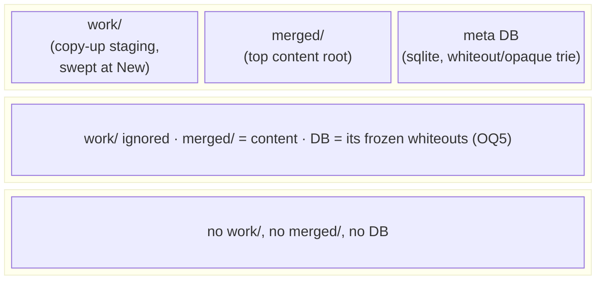
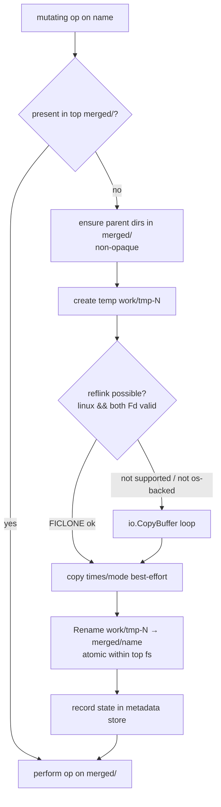
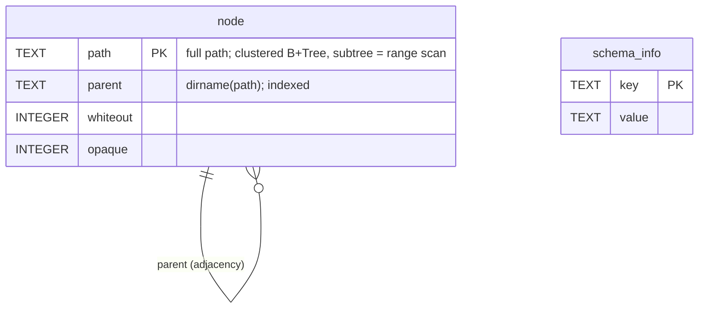

# overlayfs rewrite #2 — fuse-overlayfs-style DataSource design

Replace `vroot/overlayfs` wholesale with a design modeled on
`containers/fuse-overlayfs`: DataSource layers, a canonical top holding
`work/` + `merged/`, a CGO-free sqlite metadata store (trie schema), and
reflink-first copy-up — landing in a **new module
`vroot-adapter/overlayfs`** (D15). **Status: FINALIZED 2026-08-14 — all
open questions resolved (D1–D21); ready to implement.**

## 1. Goal / success criteria

- `vroot/overlayfs` deleted entirely; the re-implementation lives in a new
  Go module `github.com/ngicks/go-fsys-helper/vroot-adapter/overlayfs`.
- `*overlayfs.Fs` implements `vroot.Root[vroot.File, *Fs]` and passes
  `acceptancetest.RunRoot`/`RunFs` (read + write + escapes + race).
- Whiteout/opaque state never appears as files inside any layer; it round-trips
  through the sqlite store (durable across reopen).
- Default copy-up stages in top `work/`, publishes by rename into `merged/`;
  uses reflink when possible, `io.CopyBuffer` otherwise.
- `go test -race ./...` green in `vroot`; `go vet` + `golangci-lint` clean;
  `GOOS=linux|windows|darwin|plan9 go build` all pass (reflink code build-tagged).

## 2. Scope / non-goals

**In scope:** deleting `vroot/overlayfs` (package + its `acceptancetest`
subpackage); creating the new module `vroot-adapter/overlayfs` (full rewrite,
incl. a new `acceptancetest` MetadataStore harness and the module's README);
one small `vroot` core addition — the `Locker` extension interface (D22) —
plus its osfs implementation; replacing the `vroot/README.md` overlay
section with a pointer to the new module; dependency wiring
(`ncruces/go-sqlite3`, `golang.org/x/sys` for FICLONE and flock) and
`go.work` updates.

**Non-goals:**
- xattr copy / xattr-based permission emulation (`vroot.Fs` has no xattr
  surface — the reference's `xattr_permissions` machinery has nothing to attach
  to). Recorded as D10.
- fuse-overlayfs's dlopen plugin loader (`vroot.Fs` is already the pluggable
  backend boundary).
- Inode/hardlink identity across layers (`origin` xattr machinery) — vroot has
  no inode surface.
- sendfile / copy_file_range tiers in copy-up — user specified exactly
  reflink → `io.CopyBuffer` (D9).
- Multi-process concurrent use of the metadata DB: the two-level `Locker`
  mapping (D22/D23) would even permit cross-process shared readers, but the
  design runs `locking_mode=EXCLUSIVE` — one overlay owns the DB, full stop.

## 3. Context

- Current implementation: `vroot/overlayfs/` (~5.6k lines), itself the output
  of `doc/vroot/plan/01-overlayfs-redesign/` (per-path ovl-node table, append-
  log MetadataStore, Stage/DotTmp copy-up policies). No package outside
  `vroot/overlayfs` imports it — the blast radius is the package itself, its
  `acceptancetest` subpackage, and `vroot/README.md:340-400`.
- Reference: the user-given clone path `/home/watage/github.com/containers/fuse-overlayfs`
  does not exist; the real clone is
  `/home/watage/gitrepo/github.com/containers/fuse-overlayfs`. **Its `main` is
  the March-2026 Rust rewrite** (commits `7126904` rewrite, `528270c` C
  removal); the classic C implementation is reachable at commit `4759abd`. The
  Rust tree is the primary reference here (its `src/datasource.rs` `DataSource`
  trait is the naming source); C behavior is cited by `4759abd` only.
- Reference design skeleton (both C and Rust): layers ordered
  `[upper, lower1..lowerN]`; `load_dir` merges dirents first-hit-wins into a
  node arena; every mutating op goes through a `get_node_up`/`copyup` gate that
  stages in `workdir/work` and renames into the upper tree; copy-data cascade
  FICLONE → sendfile → read/write loop; whiteouts as char-0:0 / `.wh.` files
  and opaque via xattr — **the file/xattr-based masking is exactly what this
  rewrite replaces with the sqlite store.**
- `vroot` module deps today: `fsutil` + `golang.org/x/sync` only. A gitignored
  `go.work` at repo root wires local `fsutil` → `vroot` for development.
- No sqlite/KV dependency exists anywhere in the repo yet.

## 4. Approach

### 4.1 Canonical layer layout



- `DataSource` is a **concrete struct** wrapping `vroot.Fs[vroot.File]`
  (type-erased via `vroot.Widen`), with two constructors (D3). The canonical
  form addresses content under `merged/` and staging under `work/`; the plain
  form addresses content at the fs root and is **lower-only**.
- The **top must be canonical**; `New` returns an error otherwise (D4 —
  supersedes the old errorless-`New` decision D10 of plan 01).
- `work/` is swept (emptied of stale temps) at `New`, mirroring the
  reference's empty-workdir-on-mount (D8).

### 4.2 Masking (whiteout / opaque) — store only, never files

Same two-concept model as plan 01 and the reference: **whiteout** masks a name
and its whole lower subtree; **opaque** marks a top dir whose lower children
are hidden. Newly created directories are marked opaque unconditionally,
following the reference's `ovl_mkdir(set_opaque=true)` (D7); parent dirs
materialized during copy-up are NOT opaque. No `.wh.` files, no char devices,
no sentinel files ever touch a layer (D6).

### 4.3 Copy-up



- `CopyUpPolicy` stays an interface (extensible, per user). The default policy
  owns the `work/` staging + reflink cascade. Reflink = `unix.IoctlFileClone`
  on Linux when both source and dest expose a real `Fd()` (`^uintptr(0)`
  sentinel means non-os-backed → skip); everything else falls to
  `io.CopyBuffer` with a pooled buffer (`fsutil/internal/bufpool` exists). No
  sendfile / copy_file_range tier (D9).
- Temp names: monotonic counter (`tmp-<n>`) like the reference's
  `get_next_wd_counter`, not random — `work/` is private to the overlay.
- Directory copy-up creates the dir only (children stay lower-backed);
  symlinks are re-created from `ReadLink`. Special files: unsupported
  (`ErrTypeNotSupported`), as today — vroot cannot create them anyway.

### 4.4 Metadata store — sqlite over a vroot VFS (D13/D14/D17)

Whiteout + opaque paths stored as a **path-keyed trie in sqlite** (D19,
user-directed hybrid): the table is a clustered B+Tree keyed by full path —
subtree operations are index range scans — with an adjacency `parent`
column for direct-children queries. DDL in §5.

- **Driver: `github.com/ncruces/go-sqlite3`** (CGO-free, wazero-based) with a
  **custom VFS backed by `vroot.Fs`** (D13, user-chosen over the OS-path
  default): the DB file `meta.sqlite3` literally lives inside the top
  DataSource's fs, beside `work/` and `merged/` — whatever the backend
  (osfs, memfs, sftpfs…). `vroot.File` already has the needed surface
  (`ReadAt`/`WriteAt`/`Truncate`/`Sync`/`Stat`).
- The overlay is the DB's **only user**, so the VFS uses no-op/exclusive
  locking; run with `locking_mode=EXCLUSIVE` and a rollback journal (or WAL —
  WAL without shared memory requires exclusive locking anyway). Settled at
  implementation, documented in the store.
- **VFS locking via `vroot.Locker`** (D22/D23): the sqlite VFS file asserts
  the optional `vroot.Locker` extension on the opened `vroot.File`. With
  two-level locks (shared/exclusive — what POSIX and Windows natively
  offer), sqlite's 5 levels map as: `SHARED` → `Lock(LockShared)`;
  `RESERVED`/`PENDING`/`EXCLUSIVE` → `Lock(LockExclusive)` (conversion);
  `xUnlock(SHARED)` → `Lock(LockShared)` (downgrade); `xUnlock(NONE)` →
  `Unlock()`. `CheckReservedLock` answers from local state. Taking
  exclusive already at `RESERVED` blocks new readers earlier than sqlite's
  fcntl byte-range style would — correct, just less concurrent; and
  non-atomic conversion windows are covered by our `locking_mode=EXCLUSIVE`
  design, under which the lock is taken once and never converted. When the
  backend's files don't implement `Locker` (memfs, sftpfs…), the VFS falls
  back to in-process lock bookkeeping — still correct under the sole-user
  precondition, just without multi-process protection. Caveat: `Locker.Lock`
  has no try/timeout form, so a contended open blocks instead of returning
  `SQLITE_BUSY` (acceptable: contention means two overlays on one top,
  which the design forbids).
- **The canonical DataSource owns its store** (D17): `NewDataSourceCanonical`
  opens (or creates) `meta.sqlite3` through the VFS. As top the store is
  writable; stacked as a lower it is opened read-only and **its whiteouts
  keep masking deeper layers** — a stopped overlay restacks losslessly.
- **Authority model** (D14): in-memory node state is authoritative, seeded
  from the store at `New`; every masking change commits a small write-through
  transaction before the op returns. Lookups never query sqlite. `Fs.Sync()`
  is dropped — durability is per-op.

### 4.5 In-memory state & concurrency (D16)

Mirror the Rust reference (verified `overlay.rs:82-113`, `1211-1230`): a node
arena (parent links, per-dir children map + lightweight whiteout set) behind
**one coarse RWMutex** that serializes all tree/path/copy-up/store-write
logic. Data I/O on already-open `vroot.File` handles never takes the tree
lock, so reads/writes run fully parallel. Copy-up dedup falls out of the
write-lock plus an "already in top?" idempotency re-check — no singleflight.
This deliberately retires plan-01's per-node-lock design (D16).

Kept regardless: open-handle accounting to back
`DisableOpenFileRemoval` (Windows sharing-violation emulation), `OpenRoot`
sub-overlay as a base-prefix view sharing top/lowers/state, merged readdir
(top wins → higher lowers, whiteout-filtered, opaque cut-off, sorted).

## 5. Public surface delta

Everything user-visible is enumerated here; anything absent is out of scope.
Signatures marked `(OQ n)` may change when that question resolves.

```go
package overlayfs // github.com/ngicks/go-fsys-helper/vroot-adapter/overlayfs (own module, D15)

// ---- overlay ----

type Fs struct{ /* unexported */ }

var _ vroot.Root[vroot.File, *Fs] = (*Fs)(nil)

// New builds the union. top MUST be canonical (work/ + merged/); lowers are
// read-only, in MOUNT ORDER: lowers[0] is the highest-priority lower, like
// lowerdir=a:b:c (D20 — supersedes the old vroot last-wins convention).
// Resolution: top → lowers[0] → lowers[1] → … Errors: non-canonical top,
// store load failure.
func New(top *DataSource, lowers []*DataSource, opt *Option) (*Fs, error)

type Option struct {
    CopyUpPolicy           CopyUpPolicy // nil → NewCopyUpPolicyWork()
    DisableOpenFileRemoval bool
}

// Full vroot.Root[vroot.File, *Fs] method set; Close closes layers + stores.
// No Sync() method: masking changes are durable per-op (D14).

// ---- DataSource ----

type DataSource struct{ /* unexported: fsys vroot.Fs[vroot.File]; canonical bool; store *metaStore */ }

// NewDataSource wraps fsys as a plain data source: the fs root itself is the
// content root. Lower-only; rejected as top by New. No masking metadata.
func NewDataSource[F vroot.File](fsys vroot.Fs[F]) *DataSource

// NewDataSourceCanonical wraps fsys holding the canonical structure: content
// under "merged/", staging under "work/", masking metadata in "meta.sqlite3"
// — all inside fsys, the DB via the vroot-backed sqlite VFS (D13/D17).
// Creates work/ and merged/ and the DB if absent. Used as top the store is
// writable; used as a lower it is read-only and its whiteouts mask deeper
// layers. Close releases the store.
func NewDataSourceCanonical[F vroot.File](fsys vroot.Fs[F]) (*DataSource, error)

// NewDataSourceCanonicalStore is NewDataSourceCanonical with a caller-
// supplied MetadataStore in place of the default sqlite one (D18).
func NewDataSourceCanonicalStore[F vroot.File](fsys vroot.Fs[F], store MetadataStore) (*DataSource, error)

func (*DataSource) Close() error

// ---- MetadataStore (public interface kept — D18) ----

// MetadataStore persists masking state. Setters MUST be durable when they
// return (write-through, D14); lookups never hit the store — it is loaded
// once and the overlay's in-memory state is authoritative.
type MetadataStore interface {
    // Load returns all whiteout and opaque paths (clean slash paths).
    // Called once when the owning DataSource is constructed/attached.
    Load() (whiteouts []string, opaques []string, err error)
    SetWhiteout(name string) error
    ClearWhiteout(name string) error
    SetOpaque(dir string) error
    ClearOpaque(dir string) error
    Close() error
}

// NewMetadataStoreSQLite opens (creating if absent) the default trie-format
// sqlite store at name inside fsys, via the vroot-backed VFS
// (github.com/ncruces/go-sqlite3). Used internally by NewDataSourceCanonical
// with name = "meta.sqlite3"; exported for reuse and contract tests.
func NewMetadataStoreSQLite[F vroot.File](fsys vroot.Fs[F], name string) (*MetadataStoreSQLite, error)

// ---- CopyUpPolicy ----

type CopyUpPolicy interface {
    // CopyUp materializes name (a merged-view path) from `from` into top's
    // merged/ tree, staging wherever the policy chooses. top is canonical.
    CopyUp(from vroot.Fs[vroot.File], top *DataSource, name string) error
}

// Default: stage in top work/, reflink (linux, os-backed) → io.CopyBuffer,
// publish via Rename(work/tmp-N, merged/name).
func NewCopyUpPolicyWork() *CopyUpPolicyWork

var ErrTypeNotSupported = errors.New("type not supported")
var ErrNotCanonical = errors.New("data source not canonical")
```

### vroot core addition — `Locker` extension interface (D22)

```go
package vroot // github.com/ngicks/go-fsys-helper/vroot (core; the one addition there)

// LockLevel is the strength of an advisory file lock, mirroring what both
// POSIX (flock LOCK_SH/LOCK_EX, fcntl F_RDLCK/F_WRLCK) and Windows
// (LockFileEx with/without LOCKFILE_EXCLUSIVE_LOCK) natively provide.
type LockLevel int

const (
	// LockShared allows other shared holders, excludes exclusive holders.
	LockShared LockLevel = 1 + iota
	// LockExclusive excludes every other holder.
	LockExclusive
)

// Locker is an optional extension interface a [File] may implement,
// modeled on go-billy's Lock/Unlock. Assert it with a type switch:
//
//	if l, ok := f.(vroot.Locker); ok { … }
//
// Lock acquires a whole-file advisory lock at the given level (protecting
// against access from other processes). Calling Lock again with a different
// level converts the held lock; conversion is not atomic on every platform
// (it may momentarily drop to unlocked, e.g. on Windows). Unlock releases
// the lock entirely.
//
// WARNING: acquiring the lock may switch the underlying file into
// non-blocking mode as a side effect on some platforms/implementations;
// callers should tolerate that.
type Locker interface {
	Lock(level LockLevel) error
	Unlock() error
}
```

Implementations added alongside: `osfs` files (`flock` on unix,
`LockFileEx` on windows, build-tagged); `memfs`/`synthfs` files may provide
an in-process equivalent (optional — same-process exclusion only). Backends
that cannot lock simply don't implement the interface.

**Removed** (vs. today's `vroot/overlayfs`, which is deleted wholesale):
`Layer`/`NewLayer`, `MetadataStoreMem`, `MetadataStoreLog` +
`LogOption`/`SyncMode`/`LogFileName`, `SubMetadataStore`,
`CopyUpPolicyStage`/`CopyUpPolicyDotTmp` + `DefaultWorkDir`, `Fs.Sync`, and
the errorless `New`. The `MetadataStore` interface survives in the new shape
above (no `Flush` — setters are durable per-op); the
`acceptancetest.RunMetadataStore` contract harness is rewritten against it
in the new module.

### Persistent data — canonical directory layout

```
<top root>/
  work/          # staging; emptied at New; overlay-private
  merged/        # the top layer's content tree (plain files/dirs/symlinks)
  meta.sqlite3   # masking-state DB, accessed via the vroot-backed sqlite VFS
                 # (+ its transient journal file, e.g. meta.sqlite3-journal)
```

### Persistent data — sqlite trie schema v1 (CONFIRMED — D19/D21)

Per the user's OQ8 note ("mix of adjacency list and full path. Faster search
by B+Tree index range query"): the table is **keyed by the full path** and
declared `WITHOUT ROWID`, so the table itself is a clustered B+Tree over
paths — a subtree is one contiguous **index range scan**
(`path >= p||'/' AND path < p||'0'`; `'0'` is `'/'+1`, and the default
BINARY collation compares bytewise, so the range is exact). A `parent`
column keeps the **adjacency** view for direct-children queries without
scanning descendants. Paths are `TEXT` (D21): sqlite never validates UTF-8,
so rare non-UTF-8 names still round-trip; TEXT keeps the DB inspectable.

```sql
-- journal: no-shm rollback journal (locking is exclusive; the overlay is the
-- DB's only user). WAL would require locking_mode=EXCLUSIVE anyway.

CREATE TABLE IF NOT EXISTS node (
    path     TEXT NOT NULL PRIMARY KEY,   -- full clean slash path; '' = root
    parent   TEXT NOT NULL,               -- dirname(path); '' for top-level
    whiteout INTEGER NOT NULL DEFAULT 0,  -- 0|1
    opaque   INTEGER NOT NULL DEFAULT 0   -- 0|1
) STRICT, WITHOUT ROWID;                  -- clustered B+Tree keyed by path

CREATE INDEX IF NOT EXISTS node_parent ON node (parent);

CREATE TABLE IF NOT EXISTS schema_info (
    key   TEXT PRIMARY KEY,
    value TEXT NOT NULL
) STRICT;                                 -- ('version', '1')
```



Representative operations:

```sql
-- load everything at New (D14 seeds memory):
SELECT path, whiteout, opaque FROM node;
-- clear all masking under a removed/replaced dir p (one range delete):
DELETE FROM node WHERE path = :p
   OR (path >= :p || '/' AND path < :p || '0');
-- direct children of p (adjacency):
SELECT path, whiteout, opaque FROM node WHERE parent = :p;
```

Rows exist only for paths carrying masking state — sparse, not a mirror of
the filesystem. Rows with `whiteout=0 AND opaque=0` are deleted rather than
kept (a row's existence is meaningful). Trade-off vs a pure component trie:
no prefix sharing in storage (full path per row), in exchange for the range-
scan subtree ops the user asked for; the adjacency `parent` column covers
the trie-style children walk.

## 6. Implementation steps

All forks resolved; each step names the decisions it delivers.

1. **Purge & module bootstrap**: delete `vroot/overlayfs/` entirely; create
   module `vroot-adapter/overlayfs` (`go.mod` requiring `vroot`, `fsutil`,
   `github.com/ncruces/go-sqlite3`, `golang.org/x/sys`), add it to the
   gitignored `go.work`; bare `doc.go` checkpoint.
2. **`vroot.Locker` + sqlite VFS over `vroot.Fs`**: (a) add the `Locker`
   extension interface to vroot core (with the non-blocking-mode warning in
   its doc) and implement it on osfs files (`flock` unix / `LockFileEx`
   windows, build-tagged) + a Locker case in `vroot/acceptancetest` where
   applicable; (b) implement the `ncruces/go-sqlite3` VFS interfaces backed
   by a `vroot.Fs[vroot.File]` (open/read-at/write-at/truncate/sync/size/
   delete/access), locking via `Locker`'s shared/exclusive levels
   (SHARED→shared, RESERVED+→exclusive, downgrade via re-Lock — D22/D23)
   with in-process fallback; verify with a round-trip over both osfs and
   memfs, including two-handle shared/exclusive contention on osfs.
3. **Metadata store**: public `MetadataStore` interface (D18) +
   `MetadataStoreSQLite` (trie schema DDL, open/create + version check via
   `schema_info`, seeding `Load`, write-through transactional setters with
   subtree pruning); `acceptancetest.RunMetadataStore` contract harness
   rewrite (set/clear, normalization, durability across reopen, subtree
   semantics); benchmark N sequential whiteouts.
4. **DataSource**: struct + constructors (plain, canonical, canonical-with-
   custom-store), canonical validation (create-or-verify `work/`+`merged/`,
   open/create `meta.sqlite3` via the VFS), `Close`, work-sweep helper,
   content-root addressing (`merged/` join for canonical, identity for
   plain), read-only store mode for lowers (D17; immutable-style open —
   a read-only backend cannot run rollback-journal recovery).
5. **In-memory state** (D14/D16): node arena (parent links, children map,
   whiteout set) behind one RWMutex; merged lookup (whiteout ancestor walk,
   top-wins, opaque cutoff, mount order D20) and merged readdir. Masking
   keeps **per-layer provenance** (D17): a canonical lower's whiteout/opaque
   at layer i masks only layers deeper than i — never the top or shallower
   lowers — so the seed is not one flat set.
6. **Copy-up engine**: `CopyUpPolicy` interface, `CopyUpPolicyWork` default;
   `reflink_linux.go` (`unix.IoctlFileClone`, `Fd()` gating) +
   `reflink_other.go` stub; `io.CopyBuffer` fallback with `bufpool`; temp
   counter; publish-rename; parent-dir materialization gate.
7. **Fs assembly + read path**: `Fs` struct, `New` (canonical-top check →
   `ErrNotCanonical` (D4), seed arena from all canonical stores (D14/D17),
   sweep `work/` (D8)), `Option`; resolve/confine (symlink resolution over
   the merged view, `fsutil.ResolvePath`), Open/Stat/Lstat/ReadLink, merged
   dir handle, open-handle accounting, `OpenRoot` base-prefix sub-overlay.
8. **Fs write path**: copy-up gate on every mutating op; Remove/RemoveAll →
   whiteout when lower-visible; Mkdir → opaque (D7); Rename incl. the
   reference's `create_missing_whiteouts` analogue (whiteouts for lower
   entries under a moved-away dir) **and store-row migration** — with
   path-keyed rows (D19), renaming a dir with masked descendants must
   range-read + rewrite/clear rows under the old path (§5's range ops; the
   reference gets this free because its whiteout files live inside the
   renamed dir); Link/Symlink; Chmod/Chown/Chtimes/Lchown; Close (close
   stores + layers).
9. **Tests**: full `acceptancetest.RunRoot`/`RunFs`; overlay-specific
   (copy-up incl. reflink fallback, whiteout, opaque-on-mkdir, recreate-over-
   whiteout, cross-layer symlink, merged listing, canonical-lower stacking
   incl. masked deeper layers, work-sweep, no-marker-files-in-layers
   assertion); concurrency `-race` (independent paths, same-path copy-up
   dedup, crossing renames, DisableOpenFileRemoval); `fstest.TestFS` via
   `vroot.ToIoFs`.
10. **Docs & hygiene**: README for the new module; replace the
    `vroot/README.md` overlay section with a pointer to it; repo-structure
    note in `.claude/rules/local.md`-style docs if applicable; cross-GOOS
    builds; `golangci-lint`; changelog note that plan-01 API is fully
    replaced and relocated.

## 7. Testing & verification

`go test -race ./...` (vroot + fsutil), `go vet`, `golangci-lint run`,
`GOOS=linux|windows|darwin|plan9 go build ./overlayfs/...`. Reflink path gets
a Linux-only test that tolerates `ENOTSUP` filesystems (tmpfs/ext4 without
reflink) by asserting the fallback executed. sqlite store + VFS tested by
round-trips over osfs and memfs backends, including reopen-after-close
durability.

## 8. Risks

- **The vroot-backed sqlite VFS is new, non-trivial ground** (D13): sqlite is
  unforgiving about VFS semantics (sync guarantees, size queries, locking).
  Mitigations: overlay is the DB's sole user (exclusive/no-op locking is
  legitimate), `vroot.File` already offers ReadAt/WriteAt/Truncate/Sync, and
  the store is exercised over both osfs and memfs in tests. Journal mode
  chosen to avoid shm (no WAL, or WAL with `locking_mode=EXCLUSIVE`).
- **Dependency weight**: `ncruces/go-sqlite3` + wazero is a large dep tree
  for a 2-dep module (mitigation: OQ3 module placement).
- **Store write latency**: per-op write-through transactions (D14) put a
  sqlite commit (through the VFS, through vroot) on every masking change.
  Acceptable for a coarse-locked design (D16); benchmark in step 3.
- **Reflink coverage**: only meaningful when both sides are os-backed on the
  same filesystem; the gating must fail closed to `io.CopyBuffer` without
  latching false negatives for other files (per-call attempt vs. reference's
  global latch — decide in implementation).
- **Rename semantics** over lower-backed dirs (missing-whiteout creation) is
  the subtlest reference behavior; port it deliberately (step 8).
- **Non-os `Fd()` contract**: reflink gating trusts `File.Fd()`'s
  `^uintptr(0)` sentinel; a misbehaving third-party `vroot.File` could return
  a stale fd. Documented, not defended.

## 9. Open questions

Resolved 2026-08-14 (recorded as D13/D14/D16/D17 in DECISION.md): sqlite
driver+placement → **VFS over `vroot.Fs` + ncruces** (D13); authority →
**memory + per-op write-through tx, no `Sync()`** (D14); concurrency →
**coarse RWMutex, reference-style** (D16); canonical DataSource **owns its
store; lowers' whiteouts keep masking** (D17).

Resolved round 2 (2026-08-14): module placement → **new module
`vroot-adapter/overlayfs`**, `vroot/overlayfs` deleted with no in-module
replacement (D15); public store surface → **`MetadataStore` interface kept**
+ `NewMetadataStoreSQLite` + `NewDataSourceCanonicalStore` + contract
harness (D18).

Resolved round 3 (2026-08-14): layer ordering → **mount order**: `lowers[0]`
is the highest-priority lower, resolution `top → lowers[0] → lowers[1] → …`
(D20, supersedes the D12 judgment call). Trie format → **hybrid** per the
user's note: full-path clustered B+Tree key (subtree = range scan) + an
adjacency `parent` column (D19). Round 4: DDL signed off with `TEXT` path
columns (D21 — sqlite doesn't validate UTF-8, BINARY collation stays
bytewise, tooling-friendly).

**None open. Plan finalized 2026-08-14.**
