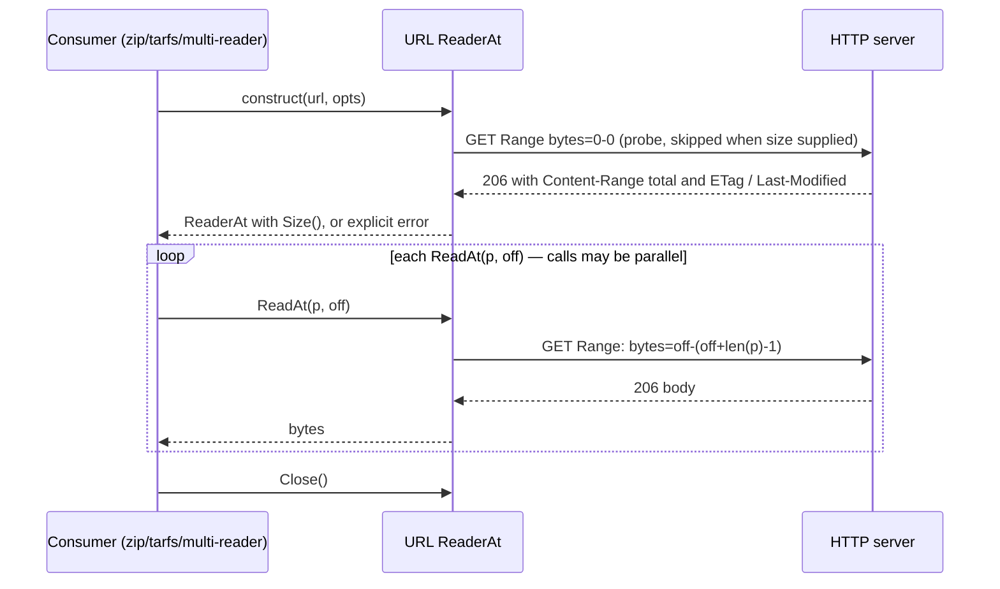

# IDEA — HTTP range-read URL as io.ReaderAt

Gate: confirmed by user, 2026-08-17

## One-line statement

Given a URL to a static remote file, a Go program should be able to treat it
as an `io.ReaderAt` (plus size), so that any random-access consumer —
`archive/zip`, `tarfs`, `stream.NewMultiReadAtSeekCloser` — can read pieces of
the remote file on demand via HTTP Range requests, without downloading the
whole thing.

## Use cases

### UC1 — Open a file inside a remote zip without downloading the archive

- **Actor**: a Go program author consuming a large `.zip` hosted on an HTTP
  server (release asset, dataset mirror, artifact store).
- **Situation**: the archive is gigabytes; only one or a few members are
  needed.
- **Intent**: `zip.NewReader(readerAt, size)` over the URL, then open members.
- **Walkthrough**:
  1. Construct the reader from the URL (with optional auth header / custom
     `*http.Client`).
  2. Construction discovers the total size (or the caller supplies it) and
     verifies the server honours byte ranges; failure here is immediate and
     explicit, not deferred to the first read.
  3. Pass the value straight to `zip.NewReader` — it satisfies `io.ReaderAt`
     and exposes `Size() int64`.
  4. zip's central-directory reads at the tail and member reads at scattered
     offsets each become bounded/suffix Range requests.
  5. `Close()` releases any kept-open connection.

### UC2 — Serve a remote tar archive through tarfs

- **Actor**: a program using `tarfs` (this repo) to expose a tar archive as an
  `fs.FS`.
- **Situation**: the tar lives behind HTTP(S) (e.g. an OCI layer blob or a
  published dataset); tarfs wants an `io.ReaderAt`-shaped source.
- **Intent**: point tarfs at the URL and browse it as a filesystem.
- **Walkthrough**: identical construction as UC1; tarfs's initial index scan
  is a mostly-sequential forward walk, later per-file reads are random
  access. Each ReadAt is its own bounded range request; a caller who wants
  fewer round-trips for the scan wraps the ReaderAt in
  `io.NewSectionReader` + `bufio.Reader` sized to taste.

### UC3 — Remote segment inside a virtual concatenation

- **Actor**: a user of `stream.NewMultiReadAtSeekCloser`.
- **Situation**: some segments are local files, some are remote objects.
- **Intent**: wrap each remote object as a `stream.ReadAtSizeCloser` and mix
  it into the multi-reader like any other segment.
- **Walkthrough**: construct one reader per URL; `SizedReadersFromReadAtSizer`
  consumes them directly because the returned type already implements
  `ReadAtSizer`.

### UC4 — Authenticated / signed endpoints

- **Actor**: same authors as above, against S3-presigned URLs, bearer-token
  APIs, or servers needing custom redirect policy.
- **Intent**: supply static headers and/or a custom `Doer`/`*http.Client`
  once at construction; every range request uses them. Secrets must not leak
  into error messages.

## Interaction shape

## Usability requirements

- **One-call construction**: URL in, ReaderAt out. Auth, custom HTTP client,
  and known-size hints are optional, not required, arguments.
- **Fail fast and loud**: a server that ignores Range headers, or whose size
  cannot be determined, is rejected at construction (or at latest on first
  read) with an error message naming the actual problem — never silent
  corruption or an unclamped -1 size.
- **Honest concurrency contract**: `io.ReaderAt`'s stdlib doc permits parallel
  ReadAt calls, and this reader genuinely supports that — each ReadAt call is
  a self-contained bounded range request; no shared mutable stream state
  (decided: D1).
- **Change detection**: if the remote object changes between requests, reads
  must fail with a distinct error rather than silently mixing bytes from two
  versions (use ETag/Last-Modified validators when the server provides them).
- **No secret leakage**: query strings, userinfo, and auth headers stay out of
  error text.
- **Cancellable**: the caller can bound the whole session with a
  `context.Context` despite `ReadAt` itself taking none.
