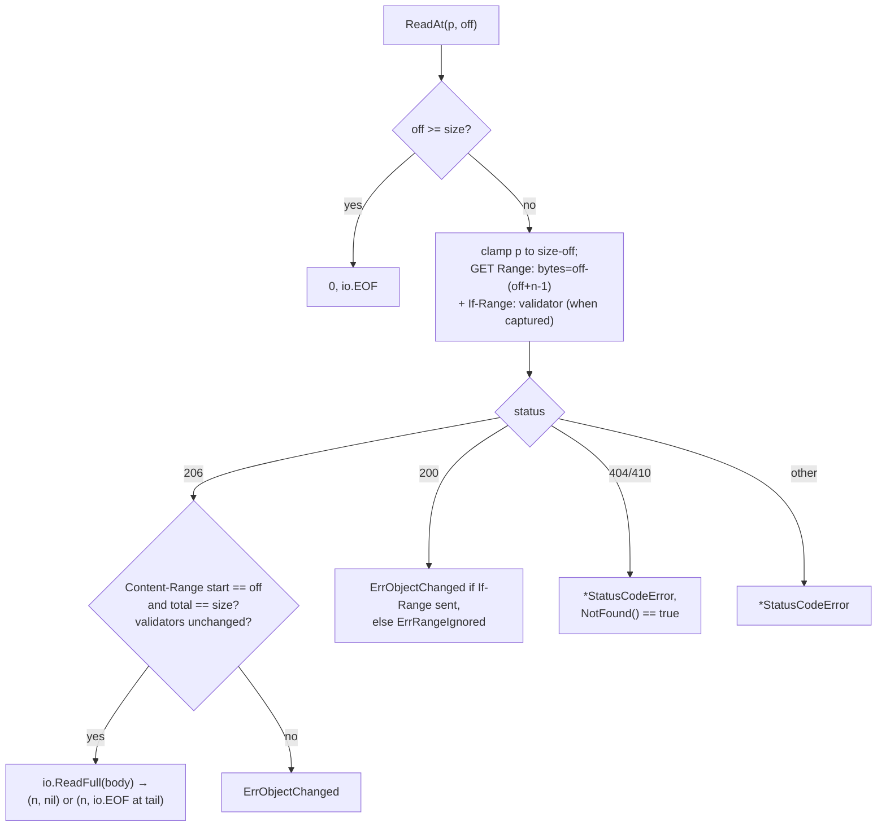

# PLAN — HTTP range-read URL as io.ReaderAt

Expose a remote URL as an `io.ReaderAt` backed by HTTP Range requests, as a
new self-contained package in the `stream` module.

## Goal / success criteria

- A consumer can go from URL (+ optional auth/client options) to a value
  usable by `zip.NewReader`, tarfs, and `stream.NewMultiReadAtSeekCloser`
  (UC1–UC3 in IDEA.md).
- Servers without range support, unknown sizes, and mid-session object
  changes produce explicit errors, never corrupt reads.
- Unit tests run against `net/http/httptest` servers (well-behaved,
  range-ignoring, size-less, mutating) — no network access in tests.

## Non-goals

- Write support (PUT/upload).
- Caching / read-ahead / progressive-stream / coalescing behavior — user
  deferred (D7) to a future explicit wrapper reader; the base
  `httprange` ReaderAt stays stateless per D1.
- Non-HTTP schemes.

## Context (current code)

- `stream/multi_read_at_closer.go` — consumer whose ReadAt path may call
  segments concurrently, so segments must be concurrent-safe; the new
  reader qualifies.
- `stream` module depends only on std (README states this); nothing here
  requires a new dependency.

## Approach

New package `stream/httprange` (D2). `New(ctx, url, cfg)` resolves size and
verifies range support with a single `GET Range: bytes=0-0` probe — skipped
when the caller supplies the size (D4) — capturing ETag/Last-Modified
validators when present (D5). It returns a concrete `*ReaderAt` whose every
`ReadAt` issues a self-contained bounded `Range: bytes=off-(off+len(p)-1)`
request (D1): no shared stream state, no locking on the read path, so
parallel ReadAt calls are safe per the stdlib `io.ReaderAt` contract. The
constructor ctx bounds every request the reader ever makes, and `Close`
cancels it (D3). Callers wanting fewer round-trips for sequential scans
wrap with `io.NewSectionReader` + `bufio.Reader`; a
progressive/caching/coalescing layer is deferred to a future explicit
wrapper (D7).

The package is self-contained: URL-secret redaction and Content-Range
parsing are implemented in-package as unexported helpers — no coupling to
any other package in the module.

Per-ReadAt request/validation flow:



## Public surface delta

The fenced block is authoritative: user-visible surface not listed here is
out of scope.

```go
// NEW package: github.com/ngicks/go-fsys-helper/stream/httprange

// Doer executes a single HTTP request. *http.Client satisfies Doer.
// (Defined at the consumer.)
type Doer interface {
	Do(req *http.Request) (*http.Response, error)
}

// Config configures New. The zero value is valid: http.DefaultClient,
// no extra headers, size discovered by probing.
type Config struct {
	// Client is the HTTP doer. nil means http.DefaultClient.
	Client Doer
	// Header holds static headers (e.g. Authorization) applied to every
	// request. Never included in error text.
	Header http.Header
	// Size, when > 0, is trusted as the object's total size and the
	// construction-time probe is skipped (D4). Range-support failures then
	// surface on the first ReadAt, and change detection degrades to
	// size/Content-Range checks because no validators are captured (D5).
	Size int64
}

// New returns a ReaderAt for url. Unless cfg.Size > 0 it issues a
// `GET Range: bytes=0-0` probe: 206 proves range support and yields the
// total size from Content-Range (416 `bytes */N` handles zero-size
// objects); 200 fails with ErrRangeIgnored; any other status fails with
// a *StatusCodeError (NotFound reports 404/410); Content-Encoding other
// than identity fails (D4).
// ctx bounds every request the returned reader will ever make (D3).
func New(ctx context.Context, url string, cfg *Config) (*ReaderAt, error)

// ReaderAt reads a remote object via bounded HTTP range requests.
// Safe for concurrent use: each ReadAt is a self-contained request (D1).
// Satisfies io.ReaderAt and, structurally, stream.ReadAtSizer (so
// stream.SizedReadersFromReadAtSizer accepts it).
type ReaderAt struct{ /* unexported */ }

func (r *ReaderAt) ReadAt(p []byte, off int64) (int, error)
func (r *ReaderAt) Size() int64
// Close cancels the session context, aborting in-flight requests and
// failing subsequent ReadAt calls. Idempotent.
func (r *ReaderAt) Close() error

// ErrObjectChanged reports that the remote object changed mid-session:
// validator mismatch, Content-Range total drift, or a 200 answer to an
// If-Range request (D5). Match with errors.Is.
var ErrObjectChanged = errors.New("httprange: remote object changed")

// ErrRangeIgnored reports that the server answered a ranged request with
// 200 instead of 206, i.e. it ignored the Range header (D10). At
// construction this means the server does not support byte ranges; on a
// later ReadAt it means a request was served without range semantics
// (unless If-Range was sent — then the 200 is ErrObjectChanged instead).
// The error message states which. Match with errors.Is.
var ErrRangeIgnored = errors.New("httprange: server ignored range request")

// StatusCodeError reports a response whose HTTP status code was not the
// one the request needed (e.g. 404, 410, 403, 5xx). Deliberately does NOT
// wrap fs.ErrNotExist even for 404/410: this reader is not a filesystem,
// and propagating fs.ErrNotExist could mislead downstream consumers that
// branch on it (D9/D11). Match with errors.As.
type StatusCodeError struct {
	// Code is the response's HTTP status code.
	Code int
}

func (e *StatusCodeError) Error() string

// NotFound reports whether Code is 404 (Not Found) or 410 (Gone).
func (e *StatusCodeError) NotFound() bool
```

No changes to any existing package or exported symbol.

## Implementation steps

1. **In-package helpers** (`stream/httprange`) — URL-secret redaction
   (strip userinfo, query, and fragment from URLs embedded in `*url.Error`
   messages, preserving the wrapped error for `errors.Is/As`) and a
   Content-Range parser returning (start, end, total), accepting the
   `bytes */N` (416) form. Unexported; covered by table tests.
2. **`stream/httprange/httprange.go`** — package doc, `Doer`, `Config`,
   `New` with the probe flow (D4): 206→size+validators, 416 `*/N`→size N,
   200→`ErrRangeIgnored` (D10), other statuses→`*StatusCodeError` with
   `NotFound()` true on 404/410 (D9/D11),
   `Content-Encoding: identity` guard, `cfg.Size > 0` skip path. Derives
   and stores the cancelable session ctx (D3, recorded deviation).
3. **`stream/httprange/reader_at.go`** — `ReadAt` per the flow diagram
   (clamp, bounded range, `If-Range` when validators captured, 206
   validation of Content-Range start/total, response validators, and
   post-redirect response origin against the pinned probe origin →
   `ErrObjectChanged` on mismatch, `io.ReaderAt` EOF semantics), `Size`,
   idempotent `Close` cancelling the session ctx. When the probe was
   skipped (`cfg.Size > 0`), validators and origin are captured lazily
   from the first 206 response (D5 addendum). All error text passes
   through the redaction helper.
4. **Tests** (`httptest`-only, no network) — table matrix: happy 206
   (start/middle/tail/exact-tail reads); server ignores Range at probe and
   mid-read → `errors.Is(err, ErrRangeIgnored)` in both; empty object via 416; mutating server (ETag flip →
   `ErrObjectChanged`; If-Range-triggered 200 → `ErrObjectChanged`;
   Content-Range total drift); caller-supplied `Size` skip path (incl.
   degraded detection); 404 and 403 → `errors.As` a `*StatusCodeError`
   with `NotFound()` true/false respectively, and NOT `fs.ErrNotExist`
   (D9/D11); secret
   redaction (token in query never in error text); parallel ReadAt under
   `-race`; ctx cancellation and Close-during-in-flight-read.
5. **Integration-style test** — `zip.NewReader(r, r.Size())` over an
   httptest server serving a zip; open and read a member (UC1). Compile
   check that `stream.SizedReadersFromReadAtSizer` accepts `*ReaderAt`
   (UC3).
6. **Docs & verification** — update `stream/README.md` (still std-only);
   run `go test ./...` in `stream` and `./govet.sh`.

## Testing / verification

Test servers, two tiers (std only, no network):

- **Conformant**: `httptest.NewServer` + `http.ServeContent` over a
  `bytes.Reader` — std's ServeContent implements single-range 206 +
  Content-Range, 416 `bytes */N` (empty-object probe), and If-Range against
  ETag/Last-Modified. Tests set the `ETag` header and a non-zero modtime
  explicitly, since ServeContent emits neither on its own. Used for the
  happy-path matrix and the zip round-trip.
- **Misbehaving**: hand-written `http.HandlerFunc`s per violation —
  ignore-Range 200, missing Content-Length, `Content-Encoding: gzip`,
  malformed/wrong-offset Content-Range, mutate-between-requests
  (ETag flip / same-size swap), 404/403/410, and a block-on-channel
  handler for cancellation tests. ServeContent cannot lie, so every
  spec-violation case is a custom handler by construction.

- httptest-based table tests: 206 happy path, 200-on-ranged-request
  rejection, missing Content-Length/-1 size rejection,
  404→`*StatusCodeError`,
  ETag change mid-session, secret redaction in error text.
- `zip.NewReader` round-trip over an httptest server as an integration-style
  test (std-only).
- Existing repo verification: `go test ./...` in `stream`, `./govet.sh`.

## Risks

- Per-ReadAt HTTP round-trips make naive sequential consumption chatty
  (accepted in D1; mitigation is caller-side buffering, documented).
- Context-in-struct collides with the repo rule "do not stash a context in a
  struct" (Q3) — needs an explicit recorded decision either way.
- Servers with unreliable validators make change-detection best-effort (Q5).

## Open questions

1. ~~Concurrency contract~~ — resolved, see DECISION.md D1.
2. ~~Placement~~ — resolved, see DECISION.md D2.
3. ~~Context plumbing~~ — resolved, see DECISION.md D3.
4. ~~Size discovery~~ — resolved, see DECISION.md D4: caller-supplied size
   skips discovery; otherwise a single `GET Range: bytes=0-0` probe (proves
   206 support, yields total size via Content-Range, checked for the
   `Content-Encoding: identity` guard). No HEAD path, no plain-GET probe.
5. ~~Change detection~~ — resolved, see DECISION.md D5.

None open.
