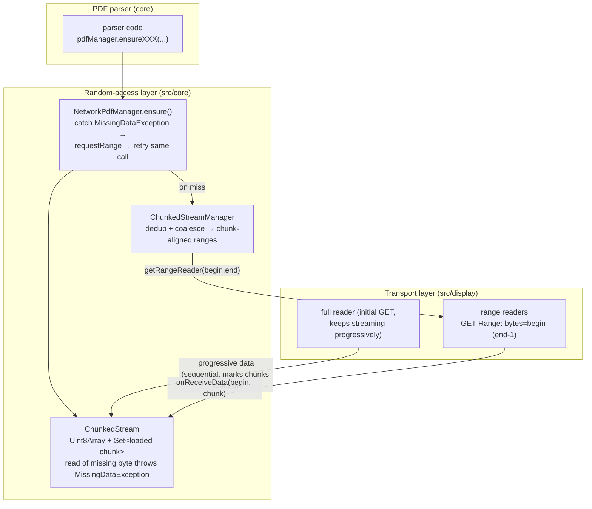
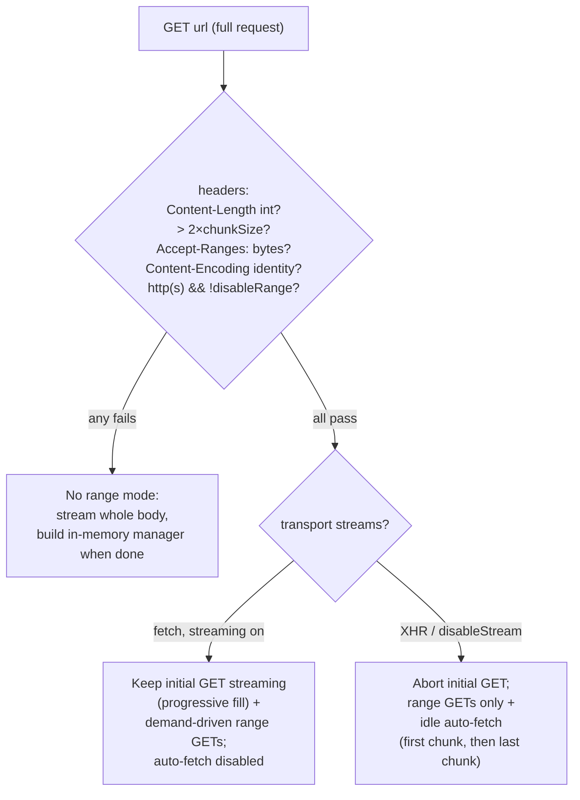

# Research — how PDF.js turns a URL into a random-accessible reader

Source: clone at `/home/watage/gitrepo/github.com/mozilla/pdf.js/master`
(current master as of 2026-08-17). All `file:line` citations below are
relative to that root. Gathered by three parallel read-only explorer agents
(network transport / chunk management / lifecycle & consistency); synthesized
here for the `stream/httprange` plan.

Version note: this master is refactored relative to most public PDF.js
write-ups — `src/interfaces.js` (`IPDFStream` etc.) is now
`src/shared/base_pdf_stream.js` (`BasePDFStream`/`BasePDFStreamReader`/
`BasePDFStreamRangeReader`), and `MissingPDFException`/
`UnexpectedResponseException` are consolidated into a single
`ResponseException(msg, status, missing)` (`src/shared/util.js:562-568`).

## 1. Architecture overview

PDF.js splits the problem into two layers that map cleanly onto our design
space:

- **Transport layer** (main thread, `src/display/`): abstract
  `BasePDFStream` with `getFullReader()` (one sequential whole-file reader)
  and `getRangeReader(begin, end)` (one reader per bounded range). Concrete
  transports: Fetch (`fetch_stream.js`, the default for http/https), legacy
  XHR (`network.js`), Node `fs` (`node_stream.js`), and an app-supplied
  custom transport (`transport_stream.js`). Selection in
  `src/display/network_stream.js:22-29`.
- **Random-access layer** (worker thread, `src/core/chunked_stream.js`):
  `ChunkedStream` — a preallocated `Uint8Array` of the whole file plus a
  `Set` of loaded 64 KiB chunks — and `ChunkedStreamManager`, which turns
  "I need bytes [a,b)" into deduplicated, coalesced, chunk-aligned range
  requests against the transport.



## 2. Range-capability detection: no probe, piggybacked on the first GET

PDF.js never issues a HEAD or probe request. It always starts **one normal
full GET**, and infers everything from that response's headers —
`validateRangeRequestCapabilities` (`src/display/network_utils.js:51-91`).
`isRangeSupported` requires ALL of:

- `Content-Length` present and integer — otherwise size is unknown and
  range support is off (`network_utils.js:68-71`);
- `Content-Length > 2 * rangeChunkSize` (default chunk 65536, so > 128 KiB
  — small files are just downloaded whole, `network_utils.js:74-78`);
- URL is http(s) and `disableRange` not set (`:79-81`);
- `Accept-Ranges: bytes` explicitly present (`:82-84`);
- `Content-Encoding` absent or `identity` (`:86-90`) — a compressed
  transfer makes byte offsets and the declared length untrustworthy, so
  ranges are refused even when `Accept-Ranges: bytes` is advertised.

What happens to that initial GET once range support is confirmed differs by
transport, and is the key design nuance:

- **Fetch path (default)**: the initial GET's body keeps streaming as a
  free progressive background download feeding the same chunk map, while
  targeted range GETs run in parallel. It is cancelled only when the caller
  disabled streaming (`fetch_stream.js:119-123`).
- **XHR path**: XHR can't stream, so the full request is aborted as soon as
  range support is confirmed and everything switches to range requests
  (`network.js:233-239` — with a code comment acknowledging this breaks
  "you can only request the PDF once" servers).

Notable: `Content-Range` totals are never used for size discovery —
`Content-Length` of the initial 200 response is the only source of truth.
The XHR path validates the shape of `Content-Range` on 206 responses
(`network.js:142-149`) but the Fetch path does not — an accidental
asymmetry, not a design. Both transports tolerate a server answering 200 to
a ranged request (RFC-permitted), status validation at `network.js:85-86`
and `fetch_stream.js:48-52`.

## 3. The chunk map and the MissingDataException loop

- Chunk size: `rangeChunkSize`, default `2**16` = 65536
  (`src/display/api.js:245-248`).
- `ChunkedStream` preallocates the whole file as one `Uint8Array(length)`
  up front (`src/core/chunked_stream.js:28-38`) and tracks loaded chunks in
  a `Set<chunkIndex>` (`:26`). Every read path (`ensureByte` `:116-133`,
  `ensureRange` `:135-156`) **synchronously throws
  `MissingDataException(begin, end)`** when it touches an unloaded chunk —
  the stream itself never awaits.
- The fetch-and-retry loop lives one level up, in
  `NetworkPdfManager.ensure()` (`src/core/pdf_manager.js:219-233`):

  ```js
  try { return await value.apply(obj, args); }
  catch (ex) {
    if (!(ex instanceof MissingDataException)) throw ex;
    await this.requestRange(ex.begin, ex.end);
    return this.ensure(obj, prop, args);   // replay the same call
  }
  ```

  Parsers are written as idempotent re-readers, so replaying the whole call
  after the data arrives is safe; the re-parsing cost is an accepted
  trade-off (comment at `chunked_stream.js:218-222`).
- `ChunkedStreamManager` request bookkeeping (`chunked_stream.js:262-377`):
  - `_requestsByChunk: Map<chunkIndex, requestId[]>` — presence of a chunk
    key means a network request for it is already in flight → per-chunk
    dedup (`:347-357`).
  - `groupChunks` (`:419-441`) merges consecutive chunk indices into
    contiguous `{beginChunk, endChunk}` groups; each group becomes one HTTP
    range request (`sendRequest`, `:284-315`). So actual wire requests are
    always chunk-aligned and coalesced, never raw parser offsets.
  - A logical request resolves when all its chunks have arrived, from any
    source — a range response or the progressive stream
    (`onReceiveData`, `:443-521`).

## 4. Progressive download + prefetch heuristics

Two independent mechanisms fill the chunk map besides demand-driven ranges:

- **Progressive full-body streaming**: the initial GET's body keeps
  arriving sequentially; `onReceiveProgressiveData` appends at
  `progressiveDataLength` and marks fully-covered chunks loaded
  (`chunked_stream.js:91-114`). Reads below that watermark never miss.
  Redundant range requests for already-streamed regions are suppressed:
  `getRangeReader` returns `null` when `end <= progressiveDataLength`
  (`src/shared/base_pdf_stream.js:72-79`).
- **Idle auto-fetch**: when no request is in flight and `disableAutoFetch`
  is false, the manager fetches one more chunk (`chunked_stream.js:487-505`)
  — with a PDF-specific twist: after the first chunk it fetches the **last**
  chunk next, because the xref/trailer lives at the tail. When the transport
  streams progressively, auto-fetch is force-disabled
  (`src/core/worker.js:234`: `disableAutoFetch ||= isStreamingSupported`) so
  the two mechanisms don't compete.

The tail-first access pattern also arises naturally from parsing: the
`startXRef` scan reads backwards from `stream.end` in 1 KiB steps
(`src/core/document.js:1091-1104`), which triggers the
MissingDataException → range-request path for the file tail.

## 5. Fallbacks, consistency, cancellation, retries

- **No range support** (any detection condition failed): no chunked
  machinery is built at all — the worker just keeps consuming the full
  stream and builds an in-memory `LocalPdfManager` from the concatenated
  bytes once done (`src/core/worker.js:228-230, 285-291`). Full download is
  the universal fallback.
- **Corrupt xref**: a later structural fallback forces download of all
  remaining chunks and re-parses in recovery mode
  (`worker.js:356-364` → `requestAllChunks`, `chunked_stream.js:321-327`).
- **Consistency across requests: none.** Repo-wide grep confirms no
  `If-Range`, `ETag`, or `Last-Modified` usage anywhere in networking code;
  request headers are only the caller-supplied static ones plus `Range`
  (`network_utils.js:20-33`, `fetch_stream.js:161`, `network.js:80`). If the
  remote file changes between range requests, PDF.js silently splices
  mismatched bytes into the same buffer. The only cross-request guard is
  **origin pinning**: the resolved (post-redirect) origin of the first
  response is recorded and every range response's origin must match
  (`network_utils.js:46-49, 117-123`; checked at `fetch_stream.js:165-167`,
  `network.js:328-336`) — an anti-redirect-swap security check, not a
  content-identity check.
- **Cancellation**: one `AbortController` per reader (full and each range,
  `fetch_stream.js:80, 149`); document destroy fans out through
  `cancelAllRequests` (`base_pdf_stream.js:85-92`) and the worker's
  `ChunkedStreamManager.abort` (`chunked_stream.js:531-539`), which rejects
  all pending request promises and drops data arriving after abort.
- **Retries: none.** No network-error retry logic exists anywhere; a failed
  range request rejects straight through to the caller. The
  `MissingDataException` loop is fetch-then-reparse, not error retry.
- **Errors**: all HTTP failures become `ResponseException(msg, status,
  missing)` with `missing = (status === 404 || (status === 0 && file:))`
  (`network_utils.js:109-115`) — the analog of our `*StatusCodeError`
  with its `NotFound()` verdict.
- **Auth**: static caller-supplied headers + a with-credentials flag, set
  once at `getDocument` time and applied identically to every request
  (`api.js:240-241`, `network_utils.js:20-33`); no refresh, no
  re-auth-on-401.

## 6. Load-strategy decision tree



## 7. Takeaways for `stream/httprange`

Mapping onto the plan's open questions (PLAN.md) and decisions (DECISION.md):

1. **Capability probing (Q4).** PDF.js's "one initial GET, read the
   headers, keep or cancel the body" pattern is an alternative to our
   HEAD-then-GET default: it costs zero extra round-trips, works on servers
   that block HEAD, and hands over the size (`Content-Length`) and range
   verdict (`Accept-Ranges`) in one shot. The Go analog: issue
   `GET Range: bytes=0-0` (or a plain GET and close the body early) at
   construction. Caveat PDF.js accepts: `Accept-Ranges: bytes` on a 200 is
   advisory — the definitive proof is a 206 answer, which our bounded-range
   probe would get directly.
2. **`Content-Encoding` guard (Q4).** Refuse range mode unless the encoding
   is `identity` — compressed transfer lengths/offsets are untrustworthy
   (`network_utils.js:86-90`). Worth copying verbatim; our current PLAN.md
   size-discovery question didn't cover this case.
3. **Change detection (Q5).** PDF.js does nothing — a deliberate gap that
   silently corrupts on mutation, exactly the failure mode our IDEA.md
   rejects. Its origin-pinning check, however, is a cheap orthogonal guard
   we could adopt: record the post-redirect origin of the first response
   and require later range responses to match.
4. **Server-ignores-Range tolerance.** PDF.js tolerates a 200 answer to a
   ranged request and (XHR path only) validates `Content-Range` shape on
   206. For `httprange` per-ReadAt bounded requests, a 200 response should
   be an error (not silently reading the whole body), and `Content-Range`
   should be validated — PDF.js's fetch/XHR asymmetry here is a bug-shaped
   inconsistency to avoid, not copy.
5. **Coalescing/caching layer is separable (out of scope, D1).** PDF.js's
   value-add for chatty readers — fixed-size chunk map, per-chunk dedup,
   contiguous-range coalescing, tail-first prefetch — lives entirely above
   its transport, in `ChunkedStreamManager`. Our D1 "each ReadAt is its own
   bounded request" matches PDF.js's *transport* (`getRangeReader`)
   contract almost exactly (`begin`/`end` exclusive-end halved-open range →
   `bytes=begin-(end-1)` inclusive header, `chunked_stream.js:284-315`,
   `fetch_stream.js:159-161`). A chunk-cache layer equivalent to
   `ChunkedStreamManager` could later be a separate wrapper around any
   `io.ReaderAt` without touching `httprange`.
6. **No retries at the transport.** PDF.js leaves retry policy to nobody —
   failures propagate. For us, leaving retry to the caller's `Doer`
   mirrors this and keeps `httprange` simple.
7. **Errors carry a "missing" verdict.** `ResponseException(msg, status,
   missing)` is almost exactly `httprange`'s planned
   `*StatusCodeError{Code}` with `NotFound() bool` — a typed status error
   carrying the code plus a not-found verdict.
