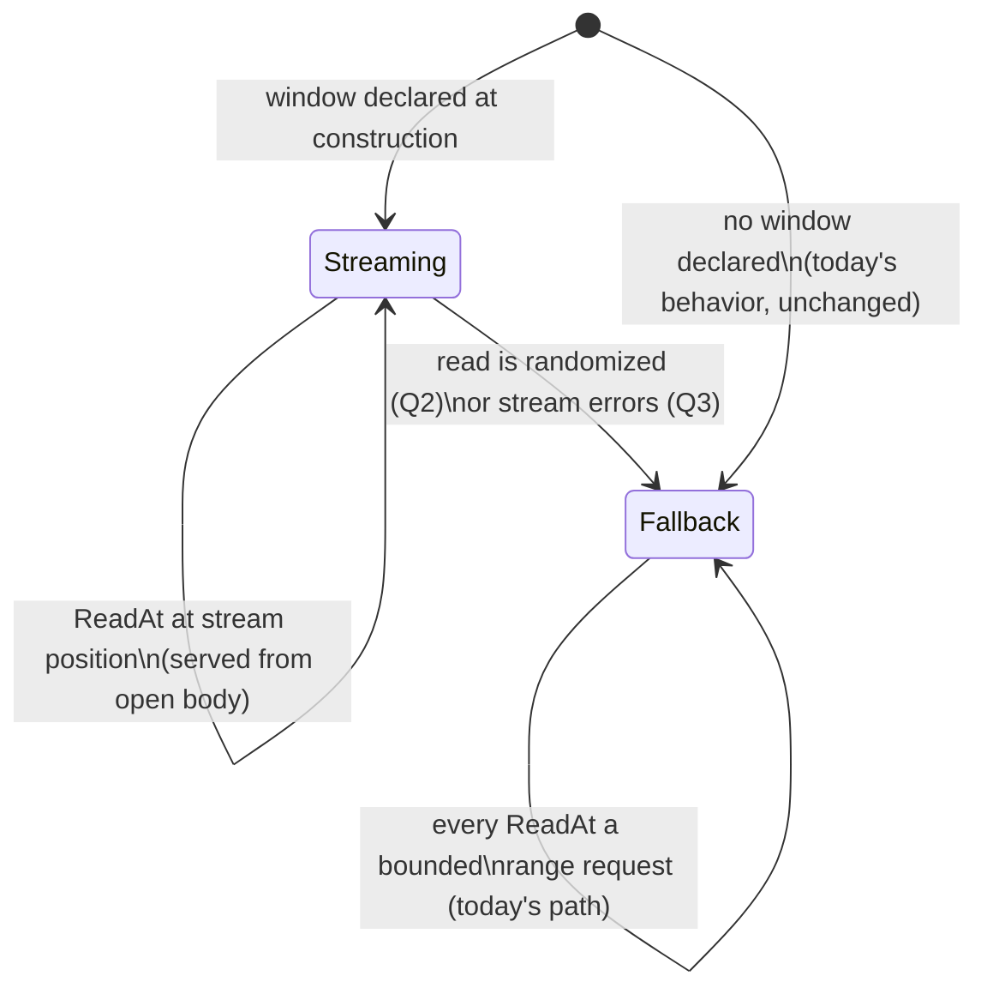

# IDEA — declared sequential window served by one streaming range request

Gate: not confirmed

This is the follow-up that `doc/plan/2026-08-17-http_range_reader_at/HANDOFF.md`
H1 hands off, scoped down from the full PDF.js-style chunk manager to the
single mechanism the user asked for. The governing prior decision, D7, says
verbatim:

> A PDF.js-style progressive stream / caching / coalescing layer (kept-open
> head stream served opportunistically, chunk map, request coalescing) is
> explicitly out of scope now and, if sequential performance matters later,
> belongs in a future explicit adapter or wrapper

and its rejected-alternatives line says verbatim:

> **Rejected**: fusing an opportunistic sequential lane into the base reader

The difference from what D7 rejected: the lane here is not *opportunistic* —
the caller **declares** the expected range up front. Whether that difference
is enough to put the lane inside `ReaderAt` (superseding D7's rejection) or
whether it must stay a separate wrapper is open question Q1.

## How it should be

A caller who already knows they are about to read a stretch of the object in
order — the whole thing, or from a resume point to the end — says so once,
up front. The reader then spends **one** HTTP range request
(`Range: bytes=<start>-`) on that stretch and feeds sequential reads from
its body as it streams in. Reads keep costing zero extra round trips for as
long as they arrive in order. The moment the read pattern stops being
sequential ("read is randomized"), the reader falls back to what the package
does today: one bounded range request per `ReadAt`. The declaration is a
hint about the future read pattern, never a change to what any read returns:
byte-for-byte, `ReadAt` behaves as if the hint had not been given, only
faster and with fewer requests.

## Use cases

### UC1 — full download, front to back

- **Actor**: a program mirroring a remote object to local disk.
- **Situation**: it wraps the object and copies it out with `io.Copy`
  (through `io.NewSectionReader(r, 0, r.Size())`), exactly the sequential
  scan the current package doc warns about.
- **Intent**: the whole transfer should be one GET, the way `curl -O` does
  it — not `size/bufsize` separate ranged round trips.
- **Walkthrough**: the caller declares "I will read from 0 to the end" when
  building the reader. The construction request is `Range: bytes=0-` and its
  `Content-Range` answers what the probe used to answer (size, validators,
  origin), so declaring the window costs no extra round trip. Every `ReadAt`
  the copy issues lands exactly at the stream's current position and is
  served from the open body. The copy completes having made one request.

### UC2 — resume a partial download

- **Actor**: the same mirroring program, restarted after an interruption.
- **Situation**: `N` bytes already sit on disk from the previous attempt.
- **Intent**: fetch bytes `N-` to the end as one request and append.
- **Walkthrough**: the caller declares "I will read from N to the end". The
  construction request is `Range: bytes=N-`; validators pinned from its
  response guard against the object having changed since is left to the
  caller (they may pass validators they saved — open question Q4 territory,
  see PLAN.md). Sequential reads from `N` stream from the one body until the
  end.

### UC3 — declared window, then the pattern breaks

- **Actor**: a consumer that starts sequential but does not stay that way —
  e.g. `archive/zip` walking entries after a tail read, or a caller that
  aborts the scan early and jumps elsewhere.
- **Situation**: a window was declared, the stream is open, and a `ReadAt`
  arrives at an offset that is not the next byte of the stream.
- **Intent**: the read must still be correct and still be served — just at
  the ordinary one-round-trip price. The declared hint must never make a
  read fail or block that would have succeeded without it.
- **Walkthrough**: the mismatched read triggers the fallback (kill vs
  bypass is open question Q2), goes out as a bounded range request exactly
  as today, and returns the right bytes. Later reads keep working; whether
  a *later sequential* read can still use the stream depends on Q2.

### UC4 — the stream dies mid-window

- **Actor**: UC1/UC2's mirroring program on a flaky connection.
- **Situation**: the streaming body errors or ends early after `M` bytes.
- **Intent**: the caller wants the bytes read so far, a real error, and a
  working recovery story — which this package already defines: resume, per
  UC2, from `start+M`.
- **Walkthrough**: the read that hits the failure returns the bytes it got
  plus the error (mirroring today's `io.ErrUnexpectedEOF` behavior). What
  later reads do — permanent fallback to bounded requests vs transparent
  retry — is open question Q3; the package's existing no-retry stance
  (Doer owns retries) leans toward fallback.

## Usability requirements

- **Declaring must be one obvious step at construction.** The common cases
  are "0 to end" and "N to end"; expressing them must not require computing
  an end offset. Note `start == 0` is a meaningful value, so the API cannot
  read a zero field as "no hint" (contract detail for PLAN.md).
- **No declaration, no change.** Callers who do not opt in get today's
  behavior, bit for bit; the zero `Config` stays usable.
- **The hint saves the probe.** When a window is declared at `New`, the
  streaming request itself proves range support and carries size,
  validators and origin — construction must not spend a separate probe
  round trip on top of it.
- **Correctness never depends on the hint being right.** A wrong or
  abandoned declaration costs performance only. All existing guarantees —
  `ErrObjectChanged` on mutation, `ErrRangeIgnored`, redaction, bounded
  per-read fallback — hold on both lanes.
- **Concurrency stays safe and stays documented.** `ReaderAt` promises
  concurrent use today; with a stream inside it, concurrent randomized
  reads must neither corrupt the stream lane nor serialize behind it.
- **Failure reads like the rest of the package.** Mid-stream death follows
  the existing vocabulary (`io.ErrUnexpectedEOF` with partial bytes,
  redacted URLs); recovery is the documented resume flow (UC2), not a
  hidden retry loop — unless Q3 resolves otherwise.
