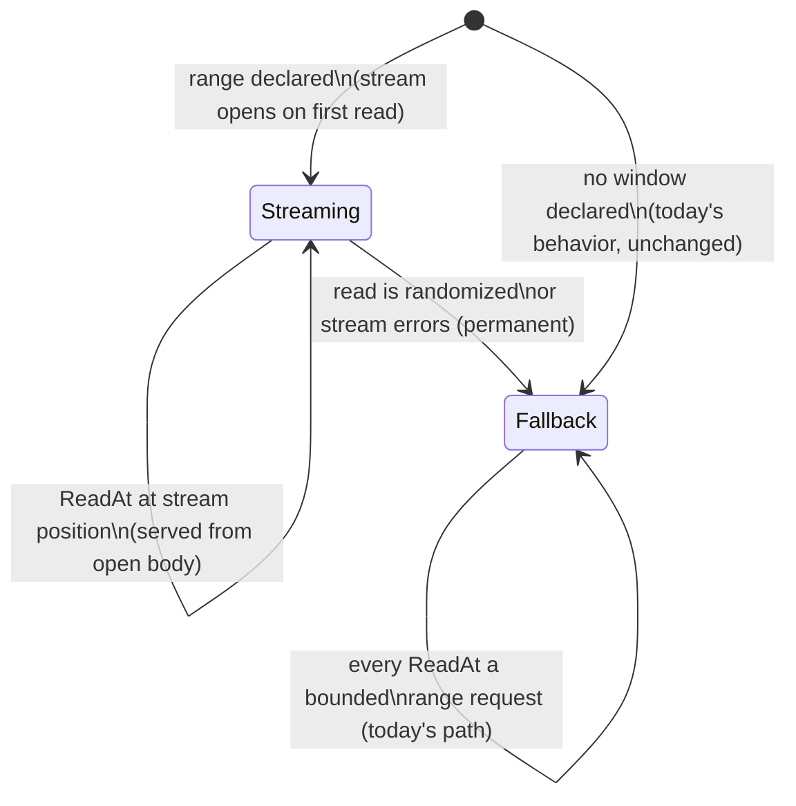

# IDEA — declared sequential window served by one streaming range request

Gate: confirmed by user, 2026-08-18 ("Confirmed but slight
modification. Remove Size." — D10's I/O-free construction confirmed
with D11, removal of the `Size()` method, folded in. Earlier
confirmations the same day: initial; after the metadata addition +
section-view contract; D8/D9 probe framing folded at the user's
direction)

This is the follow-up that `doc/plan/2026-08-17-http_range_reader_at/HANDOFF.md`
H1 hands off, scoped down from the full PDF.js-style chunk manager to the
single mechanism the user asked for. The governing prior decision, D7, says
verbatim:

> A PDF.js-style progressive stream / caching / coalescing layer (kept-open
> head stream served opportunistically, chunk map, request coalescing) is
> explicitly out of scope now and, if sequential performance matters later,
> belongs in a future explicit adapter or wrapper

and its rejected-alternatives line says verbatim:

> **Rejected**: fusing an opportunistic sequential lane into the base reader

The difference from what D7 rejected: the lane here is not *opportunistic* —
the caller **declares** the expected range up front. On that ground the user
decided (this plan's D1) that the lane lives **inside `ReaderAt`**,
superseding D7's rejected-alternatives line; D7's "explicit adapter or
wrapper" wording no longer binds this feature.

## How it should be

A caller who already knows they are about to read a stretch of the object in
order — the whole thing, or from a resume point to the end — says so once,
up front. The reader then spends **one** HTTP range request
(`Range: bytes=<start>-`) on that stretch and feeds sequential reads from
its body as it streams in. Reads keep costing zero extra round trips for as
long as they arrive in order. The moment the read pattern stops being
sequential ("read is randomized"), the reader falls back to what the package
does today: one bounded range request per `ReadAt`. The declared stretch
*is* the reader: like `io.NewSectionReader` over a local file, the reader
is a view of exactly those bytes, with offsets relative to its start and
EOF at its boundary. Within the view, expecting sequential reads is only a
performance statement — a read returns the same bytes whether it was
served from the stream or by a bounded request, so a wrong or abandoned
expectation costs round trips, never correctness.

## Use cases

### UC1 — full download, front to back

- **Actor**: a program mirroring a remote object to local disk.
- **Situation**: it wraps the object and copies it out with `io.Copy`
  (through `io.NewSectionReader(r, 0, math.MaxInt64)`, ending at EOF —
  no size needs to be known first), exactly the sequential
  scan the current package doc warns about.
- **Intent**: the whole transfer should be one GET, the way `curl -O` does
  it — not `size/bufsize` separate ranged round trips.
- **Walkthrough**: the caller declares "I will read from 0 to the end" when
  building the reader; building costs nothing, since construction never
  performs I/O. The first read opens the one `Range: bytes=0-` request,
  whose `Content-Range` answers everything a probe would (size,
  validators, origin) and is validated as the probe's own response.
  Every `ReadAt` the copy issues lands exactly at the stream's current
  position and is served from the open body. The copy completes having
  made exactly one request.

### UC2 — resume a partial download

- **Actor**: the same mirroring program, restarted after an interruption.
- **Situation**: `N` bytes already sit on disk from the previous attempt.
- **Intent**: fetch bytes `N-` to the end as one request and append.
- **Walkthrough**: during the first attempt the caller reads the object's
  metadata off the reader — even mid-download — and saves it next to the
  partial file. On restart they declare "I will read from N to the end"
  and hand the saved metadata back in. Handing it in states what the
  caller believes the object is; verifying that belief takes a request.
  The explicit way is to probe: the probe fetches the object's actual
  metadata and checks every supplied piece against it, so a changed
  object surfaces right there as `ErrObjectChanged`, before any byte
  lands. A caller who skips the explicit call still runs the probe —
  lazily, inside the first request the reader makes: the
  `Range: bytes=N-` stream open, carrying the saved validators as
  `If-Range`, is validated as the probe's own response before any of
  its bytes are used.
  Sequential reads from `N` then stream from the one body until the end,
  never splicing new-object bytes onto stale local ones.

### UC3 — declared window, then the pattern breaks

- **Actor**: a consumer that starts sequential but does not stay that way —
  e.g. `archive/zip` walking entries after a tail read, or a caller that
  aborts the scan early and jumps elsewhere.
- **Situation**: a window was declared, the stream is open, and a `ReadAt`
  arrives at an offset that is not the next byte of the stream.
- **Intent**: the read must still be correct and still be served — just at
  the ordinary one-round-trip price. The declared hint must never make a
  read fail or block that would have succeeded without it.
- **Walkthrough**: the first mismatched read **kills the stream for good**
  (this plan's D2): it goes out as a bounded range request exactly as
  today and returns the right bytes, and every later read — in-order or
  not — takes the bounded path too. One stream per reader, never re-armed;
  a caller who knows a second sequential stretch is coming builds a new
  reader for it.

### UC4 — the stream dies mid-window

- **Actor**: UC1/UC2's mirroring program on a flaky connection.
- **Situation**: the streaming body errors or ends early after `M` bytes.
- **Intent**: the caller wants the bytes read so far, a real error, and a
  working recovery story — which this package already defines: resume, per
  UC2, from `start+M`.
- **Walkthrough**: the read that hits the failure returns the bytes it got
  plus the error (mirroring today's `io.ErrUnexpectedEOF` behavior) and
  the stream is dead (this plan's D3). The reader never reopens or
  retries it — "failed connection needs explicit retry mechanism and it
  is caller's responsibility" (user). Later reads take the bounded path;
  a caller wanting the stream economics back resumes per UC2.

## Usability requirements

- **Declaring must be one obvious step at construction.** The common cases
  are "0 to end" and "N to end"; expressing "to the end" must not require
  knowing the object's size first (the `io.SectionReader` idiom of a
  `math.MaxInt64` length, as `archive/tar` uses, covers it).
- **Reads behave as today; construction gets lighter, for everyone.**
  The zero `Config` stays usable and `ReadAt` returns exactly what it
  returns today — but construction never performs I/O anymore, `New`
  included. A bad server or changed object surfaces at the first read,
  or at an explicit probe for callers who want the failure point
  earlier. The size, likewise, is something the reader knows once told
  (via `Config`) or once a response has said — never something
  construction goes out to fetch.
- **Nothing is eager.** Construction never spends a request. The probe
  is always lazy or explicit, never eager-implicit: left alone it runs
  inside the first request the reader makes, whose response is
  validated as the probe's own — so laziness never costs an extra
  round trip — and called explicitly it is its own tiny request, for
  callers who want the failure point before any byte moves. Supplying
  metadata in `Config` — the size included — seeds what the reader
  knows; it never changes *when* requests happen. The probe doubles as
  the validator of whatever was handed in: supplied pieces, even
  partial, are checked against the actually fetched data; missing
  pieces are learned from it.
- **Correctness never depends on the hint being right.** A wrong or
  abandoned declaration costs performance only. All existing guarantees —
  `ErrObjectChanged` on mutation, `ErrRangeIgnored`, redaction, bounded
  per-read fallback — hold on both lanes.
- **Metadata is readable after or in the middle of downloading.** What
  the reader has pinned about the object — validators, total size — is
  available to the caller at any moment, concurrently with reads, so the
  resume loop closes: save it during this attempt, pass it back on the
  next. It never blocks and never fires a request of its own.
- **Concurrency stays safe and stays documented.** `ReaderAt` promises
  concurrent use today; with a stream inside it, concurrent randomized
  reads must neither corrupt the stream lane nor serialize behind it.
- **Failure reads like the rest of the package.** Mid-stream death follows
  the existing vocabulary (`io.ErrUnexpectedEOF` with partial bytes,
  redacted URLs); recovery is the documented resume flow (UC2), never a
  hidden retry loop — retries stay the caller's responsibility.
