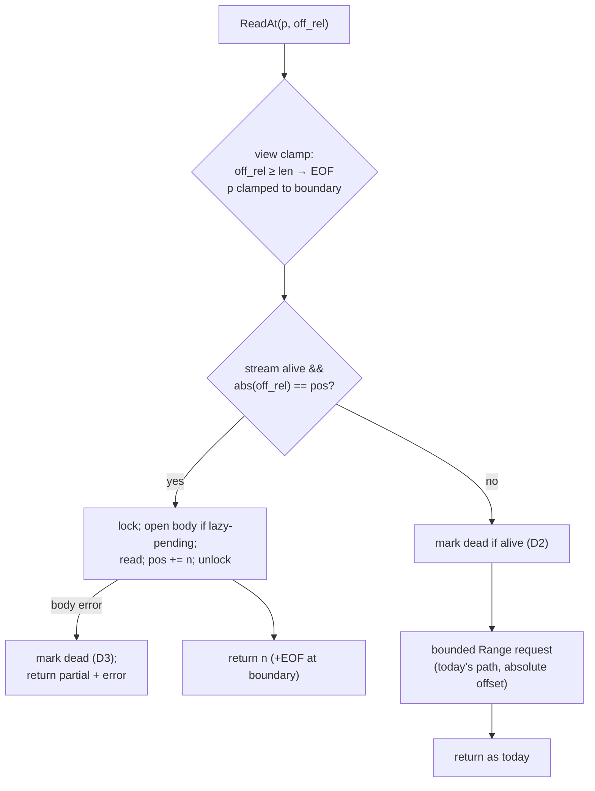

# PLAN — httprange sequential-stream lane

`NewRange` — a section view over a remote object served by one streaming
range request until reads randomize, then by today's bounded per-`ReadAt`
requests — plus exported `Probe` and `Metadata`, and saved-validator
`Config` fields.

## Goal / success criteria

- `NewRange(ctx, url, off, n, cfg)` returns a section-view `*ReaderAt`
  over `[off, off+n)` whose in-order reads are served by a single
  `Range: bytes=off-…` request (IDEA.md UC1/UC2). A front-to-back
  `io.Copy` over it makes exactly one HTTP request.
- Declaring the range replaces the construction probe when the size is
  unknown — no extra round trip versus `New` (D4).
- A randomized read still succeeds, at one bounded request, and never
  blocks or fails because of the stream (UC3, D2).
- Caller-supplied metadata (`Config.Size`/`ETag`/`LastModified`, any
  subset) is trusted until a request happens and validated the moment
  one does; `Probe` is the explicit way to make that moment happen up
  front (D4/D6/D8) — a resume caller probing first learns of a changed
  object there, as `ErrObjectChanged`, before any byte lands. The
  metadata to save for the next attempt is readable off the reader
  after or in the middle of downloading (D7).
- `New`'s behavior without new fields is unchanged; the existing test
  suite passes untouched.
- `go test -race ./...` green, including concurrent mixed
  sequential/random reads against one reader.

## Scope

`stream/httprange` only: `NewRange`, exported `Probe` and `Metadata`,
`Config` validator fields, the internal stream lane, docs, and tests.

## Non-goals

- Chunk map, caching, request coalescing, idle auto-fetch — the rest of
  prior HANDOFF H1's `ChunkedStreamManager` shape stays future work
  (still recorded unclaimed in
  `doc/plan/2026-08-17-http_range_reader_at/HANDOFF.md`).
- Retry policy: stays with the caller's `Doer` (D3).
- Re-arming: one stream per reader; no second stream after a kill (D2) or
  a mid-stream failure (D3).
- Changing `New`'s probe default (D4 keeps it).

## Context

- `stream/httprange/httprange.go:167` — `New`; `:247` unexported
  `probe()` spends one `bytes=0-0` GET on size + range proof + meta
  pinning; `:311` `r.meta.Store(...)` unconditionally overwrites meta
  (must become pin-or-verify once `Config` can pre-pin, D6).
- `stream/httprange/reader_at.go:33` — `ReadAt` is stateless per call
  today; the stream lane adds shared mutable state that must not break
  the documented concurrency promise (`httprange.go:98`).
- `stream/httprange/reader_at.go:128` — `checkPartial` gates every 206;
  the streaming response passes an equivalent gate once, at open.
- `stream/httprange/reader_at.go:185` — `ifRangeValue` already reads
  pinned meta; pre-pinned caller validators ride it for free.
- `stream/httprange/httprange.go:229` — `newRequest` strips
  `Range`/`If-Range` from `Config.Header`, which is why saved validators
  need first-class fields (D6).
- Prior art: `doc/plan/2026-08-17-http_range_reader_at/` (D1, D7,
  HANDOFF H1, research doc §4/§7).

## Approach

One reader type, two lanes (D1). `NewRange` builds the same `*ReaderAt`
as `New` plus a stream-lane struct: the absolute base `off`, the view
length, and mutex-guarded stream state (body, absolute position, alive
flag). View arithmetic (relative→absolute, clamp, boundary EOF —
`io.SectionReader`'s rule, D5) happens at the top of `ReadAt`; then:

- offset == stream position and stream alive → lock, read from the body,
  advance. The check happens outside the lock (position stored
  atomically) so a randomized read never queues behind stream I/O.
- anything else → the stream is killed (once, permanently, D2/D3) and
  the read takes today's bounded path with the translated absolute
  offset.

Stream opening (D4): eager at `New`-time when the size is unknown — the
`Range: bytes=off-…` response then doubles as the probe (size from
`Content-Range` total, meta pin, range proof). Lazy when `cfg.Size > 0`:
no I/O at construction, the stream opens under the lock on the first
in-order read; callers wanting an early failure point call `Probe`
first. The streaming response passes the same gate as any read: status
206 (416 with `bytes */N` = empty view), `checkContentEncoding`,
`Content-Range` start/total check, meta pin-or-verify, `If-Range` when
meta is pinned.



Rejected shapes: separate wrapper type (Q1/D1); bypass-and-keep-open
(Q2/D2); transparent reopen (Q3/D3); `Window` struct with validator
fields (folded into `Config` instead, D6); whole-object reader with the
range as a mere hint (D5 — the user's `io.SectionReader` rule makes it
a view).

## Public surface delta

```go
package httprange

// NewRange returns a ReaderAt over the section [off, off+n) of the
// remote object, as io.NewSectionReader does for a local one: offsets
// are relative to off, Size reports the view's length, and reads hit
// EOF at the boundary. n larger than the remainder is clamped; use
// math.MaxInt64 to say "from off to the end" (archive/tar's idiom for
// io.SectionReader); n <= 0 yields an empty view. It is New, slightly
// optimized for reading the section mostly front to back: one streaming
// range request serves in-order reads until the first out-of-order read
// or stream error, after which every read is a bounded request of its
// own, as under New. cfg.Size semantics match New: zero means the
// stream opens at construction and doubles as the probe; positive means
// no I/O until the first read (call Probe for an early failure point).
func NewRange(ctx context.Context, url string, off, n int64, cfg *Config) (*ReaderAt, error)

// Probe validates the reader's picture of the remote object against
// what the server actually has, right now: one GET Range: bytes=0-0
// that proves the server honours Range, checks every piece of metadata
// already held — caller-supplied Config fields (Size, ETag,
// LastModified, any subset) included — against the fetched response,
// failing with ErrObjectChanged on contradiction, and pins whatever
// was not yet known. Until some request happens (Probe, the stream
// opening, or a read), caller-supplied metadata is trusted, not
// verified; Probe is the explicit way to put that verification — and
// the failure point — here rather than at the first read. ctx bounds
// this call only.
func (r *ReaderAt) Probe(ctx context.Context) error

type Config struct {
    Client Doer        // unchanged
    Header http.Header // unchanged
    Size   int64       // unchanged

    // ETag and LastModified are validators the caller saved from an
    // earlier response, for resuming. They pre-pin the object identity
    // at construction and ride every request's If-Range (subject to
    // the same strong-validator rule as pinned ones) — but they are
    // trusted, not verified, until a request actually happens: the
    // first response (Probe's, the stream's, or a read's) is checked
    // against them and contradicts them with ErrObjectChanged before
    // any of its bytes are used. Call Probe to make that check happen
    // up front. Empty means none, as today.
    ETag         string
    LastModified string
}

// Metadata is a snapshot of what the reader has pinned about the remote
// object. Size is the total size of the object — under NewRange this is
// not the view length that ReaderAt.Size reports.
type Metadata struct {
    ETag         string
    LastModified string
    Size         int64
}

// Metadata reports the pinned object metadata and whether anything is
// pinned yet (false only on a lazily-opened reader before its first
// request, when Config carried no validators either). It is safe to
// call while reads are in flight, never blocks on them, and never
// issues a request of its own.
func (r *ReaderAt) Metadata() (Metadata, bool)
```

Everything else exported is unchanged. `NewRange(ctx, url, 0,
math.MaxInt64, nil)` is `New` plus the streaming lane.

## Implementation steps

1. **Config validators (D6)** — `httprange.go`: add `Config.ETag` /
   `Config.LastModified`; `New`/`NewRange` pre-pin
   `objectMeta{etag, lastModified}` when either is set. Change
   `probe()`'s unconditional `r.meta.Store` (`httprange.go:311`) and
   `checkPartial`'s CAS path (`reader_at.go:148-152`) into a shared
   pin-or-verify helper: pin fields that are empty, `ErrObjectChanged`
   on contradiction. In the same step add `Metadata`/`Metadata()` (D7)
   over the pinned state — the atomic `r.meta` load plus the settled
   size — since both features live on the same pin-or-verify plumbing.
   Judgment call: `ok` means the object's *identity* is pinned (a
   response seen, or `Config` carried a validator); the snapshot's
   `Size` is filled from `cfg.Size` even while `ok` is false, since a
   caller-supplied size is known without being pinned.
   Verifiable alone: resume-mismatch test (server with new ETag → first
   read fails), `ifRangeValue` sends the saved validator on the very
   first request, `Metadata()` reflects a Config pre-pin immediately
   and probe results after.
2. **Exported `Probe(ctx)` (D4, D8)** — `httprange.go`: refactor
   `probe()` to take a ctx and to run every already-held metadatum —
   `cfg.Size` and the pre-pinned/pinned validators, each independently
   — through the step-1 pin-or-verify helper against the fetched
   response (`ErrObjectChanged` on any contradiction, pin what was
   empty). `New` keeps calling it as today; the exported wrapper
   documents scope of ctx. Verifiable alone: probe-after-Size-config
   test, probe-mismatch test, partial-metadata probes (only
   LastModified supplied → it is checked, ETag+size get pinned).
3. **Stream lane (D1/D2/D3/D4)** — new file `stream.go`: the lane
   struct (mutex, body, atomic absolute pos, alive/lazy-pending state),
   `openStream` building `Range: bytes=off-` or `bytes=off-(end-1)`,
   response gate (206 / 416-empty-view / 200+If-Range→`ErrObjectChanged`
   / 200→`ErrRangeIgnored`, `checkContentEncoding`, `Content-Range`
   start/total check, meta pin-or-verify from step 1), `kill()` closing
   the body via `drainAndClose`. No wiring into `ReadAt` yet.
   Verifiable alone: unit tests over the gate against a stub server.
4. **`NewRange` + `ReadAt` wiring (D5)** — `httprange.go`/`reader_at.go`:
   constructor (validate `off >= 0`, clamp/empty-view rules, eager open
   when size unknown — including 416 empty-view and n<=0 no-request
   paths), view translation at the top of `ReadAt` (relative offset,
   `Size()` = view length, boundary EOF per `io.SectionReader`), lane
   fast-path check before the lock, fallback + permanent kill on
   mismatch or body error (partial bytes + error surfaced as today's
   `io.ErrUnexpectedEOF` wording), `Close` tearing down the body.
   Verifiable: UC1/UC2 request-count tests pass end to end.
5. **Docs** — `doc.go`: replace the "price is one HTTP round trip per
   ReadAt … give such a scan a buffer" paragraph's story with the two
   options (buffer, or `NewRange` when the range is known up front);
   method docs per the surface delta; note the concurrency story of the
   lane on the `ReaderAt` doc (`httprange.go:95-99`).
6. **Test matrix** — `stream/httprange`: request-count assertions
   (UC1 full copy = 1 request; UC2 resume = 1), fallback matrix (UC3:
   out-of-order read kills, later in-order reads stay bounded; killed
   lane never reopens), mid-stream death (UC4: partial bytes + error,
   later reads bounded), lazy-open with `Size` set (zero requests at
   construction), `Probe` early-failure, saved-validator resume
   mismatch, empty view (`off >= total`, `n <= 0`), `Metadata()` read
   mid-download and after (D7, including under `-race` alongside a
   streaming walker), race test mixing
   one sequential walker with random readers, and the zip round-trip
   (`zip_test.go`) rerun over a `NewRange(0, MaxInt64)` reader.

Each step compiles and passes `go test -race ./...` + `./govet.sh` (as
the prior plan used) before the next.

## Testing and verification

Covered per step above; the bar for done is the step-6 matrix green
under `-race`, the pre-existing suite untouched and green, and a manual
`io.Copy` smoke against a real HTTP server (Go `http.FileServer`)
observing exactly one access-log line for a full copy.

## Risks

- Shared stream state vs the documented concurrency promise: mitigated
  by the check-outside-lock design (step 4) and the race test (step 6);
  the failure mode to watch is a randomized read blocking behind a slow
  stream read.
- Stream-served bytes skip a per-read `Content-Range` check by nature;
  consistency rests on the open-time gate plus pinned meta. Bytes are
  still positionally exact because TCP ordering is the stream.
- A slow server holds the streaming connection for the reader's
  lifetime; `Close`/ctx cancellation must reliably abort it (step 4
  test: Close while a stream read is blocked).
- Lazy lane + concurrent first reads: two goroutines both at `pos` —
  the lock serializes opening; the loser sees `pos` advanced and falls
  back (acceptable: hint is performance-only).

## Open questions

None — Q1–Q6 resolved as DECISION.md D1–D6.

## Traceability

- D1 "lives inside httprange.ReaderAt" → steps 3–4.
- D2 "closes the stream for good … never re-armed" → step 4; proven in
  step 6 fallback matrix.
- D3 "let it fail … retry is caller's responsibility" → step 4 (no
  reopen path exists); step 6 death tests.
- D4 "Probe exported … eager when size unknown, lazy when known" →
  steps 2 (Probe), 3–4 (eager/lazy open); step 6 lazy/Probe tests.
- D5 "section view, io.SectionReader rule, MaxInt64 idiom, n<=0 empty"
  → step 4; documented in step 5; step 6 empty-view tests.
- D6 "Config.ETag/LastModified pre-pin, If-Range, ErrObjectChanged" →
  step 1; step 6 resume-mismatch test.
- D7 "get metadata after or in-mid downloading" → step 1 (`Metadata`
  type + accessor); documented step 5; step 6 mid-download tests.
- D8 "Probe … should be also a validator; … validate against actually
  fetched data on Probe time" → step 2; documented in the surface
  delta's Probe/Config comments; step 6 partial-metadata probe tests.
- Inherited prior-D1 concurrency promise → step 4 design + step 6 race
  test.
- IDEA use cases: UC1/UC2 → steps 3–4, proven step 6 request counts;
  UC3 → step 4 + matrix; UC4 → step 4 + death tests.
